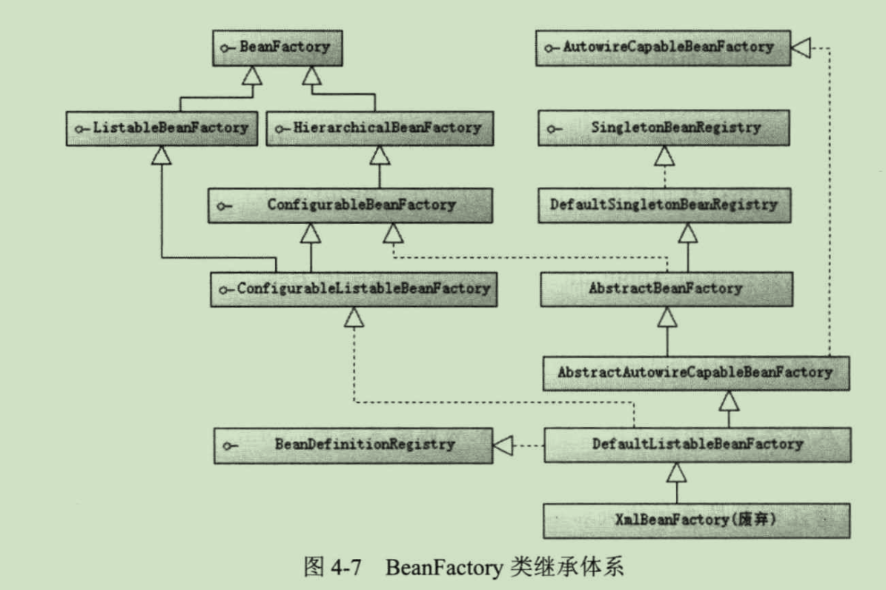

Bean工厂是Spring最核心的接口，最重要的接口有两个：`BeanFactory`，`ApplicationContext`。

`BeanFactory`接口提供了IOC机制，而`ApplicationContext`接口扩展了`BeanFactory`，提供了更多实用的功能，例如国际化支持和框架事件体系等。

`BeanFactory`是Spring的基础设施，`ApplicationContext`是面向使用Spring的开发者的，在绝大多数情况下，使用ApplicationContext就已经足够。

`BeanFactory`的继承体系如下

