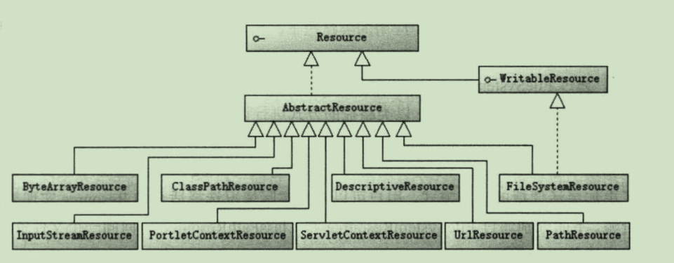

## 1.资源访问抽象接口
Spring提供了**Resource**接口，该接口有对于不同资源类型的实现类，其主要方法有：

- boolean exists()：资源是否存在
- boolean isOpen()：资源是否打开
- URL getURL()throws IOException：如果资源可以用URL表示，返回对应的URL对象。
- File getFile()throws IOException：如果资源对应一个文件，返回对应的File对象。
- InputStream getInputStream()throws IOException：返回资源对应的输入流。


<center>Resource及其实现类</center>

- `WritableResource`：可写资源接口，有两个实现类，`FileSystemResource`和`PathResource`。
- `ByteArrayResource`：二进制数组资源，可以在内存中构造。
- `ClassPathResource`：类路径下的资源，以相对于类路径的方式表示。
- `FileSystemResource`：文件系统资源，以文件系统路径方式表示。
- `InputStreamResource`：以输入流表示的资源。
- `ServletContextResource`：Web应用根目录下的资源，支持以流和URL的方式访问，在WAR解包的情况下可以通过File访问，还可以之间访问jar包中的资源。
- `UrlResource`：通过URL表示的资源，如文件系统，HTTP,FTP等。

例如：以UrlResource访问HTTP资源
```java
try {
    Resource resource = new UrlResource("https://www.cnblogs.com");
    InputStream stream = resource.getInputStream();
    PrintStream printStream = new PrintStream(System.out);
    Scanner scanner = new Scanner(stream);
    while (scanner.hasNext()){
        printStream.print(scanner.nextLine()+"\r\n");
    }
    stream.close();
    printStream.close();
} catch (MalformedURLException e) {
    e.printStackTrace();
} catch (IOException e) {
    e.printStackTrace();
}
```
另外，在读取资源时，默认采用系统编码读取内容，如果资源文件采用特殊的编码格式，可以通过`EncodedResource`对资源进行编码，防止出现乱码。
```java
Resource res = new FileSystemResource("d://a.txt");
EncodedResource encode = new EncodedResource(res,"UTF-8);
```

## 2.资源加载
除了统一访问接口外，Spring还提供了一种加载资源的机制，可以通过资源地址前缀或Ant风格带通配符的资源地址来加载资源。
### 2.1Spring支持的资源地址前缀
|地址前缀|示例|对应的资源类型|
|:-------|:----|:-------------|
|classpath:|classpath:com/test/app.xml|从类路径中加载，`classpath:`和`classpath:/`是等价的。资源可以是文件系统，也可以是jar或zip。|
|file:|file:com/test/app.xml|使用UrlResource从文件系统中加载资源，可使用绝对路径或相对路径。|
|http:|http://www.test.com/test.xml|使用UrlResource从Web服务器中装载资源|
|ftp:|ftp://www.test.com/test.xml|使用UrlResource从FTP服务器中装载资源|
|没有前缀|com/test/app.xml|根据ApplicationContext的具体实现类采用对应类型的Resource|
### 2.2classpath:和classpath*:的区别
假设有多个jar包或文件系统类路径有一个相同的包名，`classpath:`只会在第一个加载的jar包的类路径下查找，而`classpath*:`会扫描所有这些jar包的类路径。

### 2.2Ant风格的资源地址
Ant风格的资源地址支持三种匹配符

- `？`：匹配文件名中的一个字符
- `*`：匹配文件名中的任意字符
- `**`：匹配多层路径
例如：

|资源地址|可匹配文件|
|:--------|:---------|
|`classpath:spring/spring?.xml`|匹配类路径下的spring/spring1.xml,spring/spring2.xml,spring/spring3.xml。|
|`classpath:spring/*.xml`|匹配类路径下，spring目录下所有以.xml结尾的文件。|
|`classpath:/spring/**/*.xml`|匹配类路径下，Spring目录及其子目录下所有以.xml结尾的文件。如：spring/test.xml,spring/content/test.xml。|

Spring定义了一套资源加载的接口，并提供了实现


`ResourceLoader`接口仅有一个`getResource`方法，可以根据资源地址前缀加载文件资源，但是不支持Ant风格的表达式。
`ResourcePatternResolver`接口扩展`Resource`接口，定义了一个新的`getResource`方法，该方法支持资源地址前缀及Ant风格的表达式。
Spring提供了`PathMatchingResourcePatternResolver`这个实现类。
```java
    ResourcePatternResolver resolver = new PathMatchingResourcePatternResolver();
    try {
        Resource[] resources = resolver.getResources("classpath:spring/**/*.xml");
        for (Resource resource : resources) {
            System.out.println(resource.getDescription());
        }
    } catch (IOException e) {
        e.printStackTrace();
    }
```